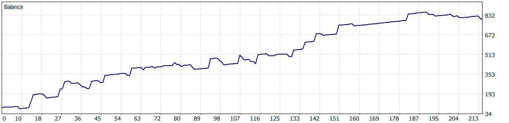
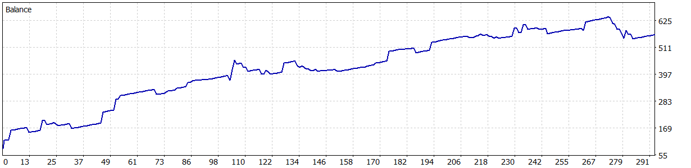

# Nexus Confluence EA v3.0.1

**Expert Advisor Profissional para MetaTrader 5**
Sistema de Confluencia Multi-Timeframe com 6 Gates de Validacao | Arquitetura Hibrida MQL5 + C++ DLL

---

## Arquitetura

```
MQL5 (Wrapper fino)          C++ DLL (Toda logica)
  OnTick() ───────────────>  NX_ProcessTick()
  iCustom() indicators       5 indicadores internos
  CTrade orders               6 gates sequenciais
  Chart panel                 Risk management
```

- **DLL Total**: ~9,700 linhas C++ | Compilada com MinGW-W64 GCC 15.2 x64
- **MQL5 Wrapper**: ~500 linhas | Orquestra dados, ordens e visualizacao
- **Indicadores visuais**: 5 arquivos `.ex5` para plot no grafico (calculo na DLL)

## Sistema de 6 Gates

| Gate | Nome | Funcao |
|------|------|--------|
| **Gate 1** | Market Access | Spread filter (absoluto + dinamico), time filter, day filter |
| **Gate 2** | MTF Analysis | GG TrendBar em 3 macro TFs + operational. Score -4 a +4 |
| **Gate 3** | Supertrend | TrendMagic (CCI + Kaufman ER) confirma direcao |
| **Gate 4** | Signal Quality | OBV MACD threshold + RSI OMA crossover. RSI OB/OS filter |
| **Gate 5** | Trend Quality | Efficiency Ratio min + momentum ratio + ER decline filter |
| **Gate 6** | Risk Check | Max positions, cooldown anti-churn, macro flip cooldown |

## Indicadores Internos (DLL)

| Indicador | Descricao |
|-----------|-----------|
| **GG TrendBar** | ADX + Parabolic SAR + DI em 15 timeframes. Bar-time guard |
| **TrendMagic** | CCI + Kaufman ER + True Range EMA (sem ATR) |
| **OBV MACD** | On-Balance Volume + MACD com threshold dinamico |
| **RSI OMA** | RSI + Optimal Moving Average + hysteresis |
| **Currency Strength** | Forca relativa das moedas do par |

## Gestao de Risco

- **Break Even**: trigger + step configuravel por BUY/SELL
- **Trailing Stop**: ativacao independente BUY/SELL
- **Drawdown Protection**: daily max %, consecutive loss limit, lot reduction
- **Dynamic SL/TP**: escala baseada no Efficiency Ratio
- **Cooldown Anti-Churn**: bloqueia re-entrada na mesma direcao apos SL

---

## Resultados de Backtest (2024.01 - 2026.03)

### XAUUSD H1

| Metrica | Valor | Status |
|---------|-------|--------|
| **Net Profit** | $709.64 (+855%) | VERDE |
| **Profit Factor** | 2.24 | VERDE |
| **Recovery Factor** | 8.90 | VERDE |
| **Sharpe Ratio** | 9.53 | VERDE |
| **Max DD (Balance)** | 13.64% | VERDE |
| **Total Trades** | 214 | OK |
| **Win Rate** | 85.05% | VERDE |
| **Max Consec Wins** | 32 | VERDE |
| **Max Consec Losses** | 3 | VERDE |
| **Avg Win / Avg Loss** | $7.04 / $17.85 | Payoff 0.39 |
| **Deposito Inicial** | $83.00 | |



### USDJPY H1

| Metrica | Valor | Status |
|---------|-------|--------|
| **Net Profit** | $481.74 (+580%) | VERDE |
| **Profit Factor** | 1.90 | VERDE |
| **Recovery Factor** | 4.29 | VERDE |
| **Sharpe Ratio** | 6.70 | VERDE |
| **Max DD (Balance)** | 14.68% | VERDE |
| **Total Trades** | 292 | OK |
| **Win Rate** | 86.64% | VERDE |
| **Max Consec Wins** | 37 | VERDE |
| **Max Consec Losses** | 4 | VERDE |
| **Avg Win / Avg Loss** | $4.02 / $13.74 | Payoff 0.29 |
| **Deposito Inicial** | $83.00 | |



### Comparativo

| Metrica | XAUUSD | USDJPY |
|---------|--------|--------|
| Net Profit | $709.64 | $481.74 |
| Profit Factor | 2.24 | 1.90 |
| Recovery Factor | 8.90 | 4.29 |
| Sharpe | 9.53 | 6.70 |
| Max DD % | 13.64% | 14.68% |
| Win Rate | 85.05% | 86.64% |
| Trades | 214 | 292 |

---

## Otimizacao 3 Rounds

```
R1 Foundation  -> TFs + GG TrendBar + Supertrend + Scores + State (16 params)
R2 Signal      -> MACD + RSI + Gates 4/5 + Spread (16 params)
R3 Exits       -> SL/TP + BE + TS + DD protection (16 params)
```

Cada round: MT5 Strategy Tester | Genetico | Every tick | WF 1/3 | Criterio complexo maximo

## Presets Disponiveis

| Arquivo | Ativo | Status |
|---------|-------|--------|
| `Presets/V3/NexusV3_FINAL_XAUUSD_H1.set` | XAUUSD H1 | FINAL |
| `Presets/V3/NexusV3_FINAL_USDJPY_H1.set` | USDJPY H1 | FINAL |

## Instalacao

1. Copiar `NexusConfluence.dll` para `MQL5/Libraries/`
2. Copiar `NexusConfluenceV3.ex5` para `MQL5/Experts/NexusConfluenceV3/`
3. Copiar indicadores `.ex5` para `MQL5/Indicators/NexusConfluenceEA/`
4. Copiar `.set` para `MQL5/Experts/NexusConfluenceV3/set/`
5. Abrir chart (ex: USDJPY H1) -> Attach EA -> Load preset -> Enable DLL imports

## Requisitos

- MetaTrader 5 (build 5660+)
- Windows x64 (DLL requer Windows)
- Broker com hedging mode
- Leverage: 1:200 recomendado

## Estrutura do Projeto

```
DLL/
  include/          # Headers C++ (gates, indicators, types)
  src/              # Implementacao C++ (gate_system, indicators)
  CMakeLists.txt    # Build system

MQL5/
  Experts/NexusConfluenceV3/
    NexusConfluenceV3.mq5   # EA wrapper
  Include/NexusConfluenceV3/
    NexusV3Bridge.mqh       # DLL bridge
    NexusV3Inputs.mqh       # Input parameters

Presets/V3/         # .set files finais
Reports/            # Backtest reports (HTML + PNG)
```

## Producao

- **Servidor**: Oracle Cloud VM.Standard.E3.Flex (1 OCPU, 8GB RAM)
- **OS**: Windows Server 2022 Standard
- **Broker**: EasyMarkets (Blue Capital Markets Limited)
- **Ativos em producao**: USDJPY, XAUUSD

---

*Nexus Confluence EA v3.0.1 - Desenvolvido para trading algoritmico profissional*
