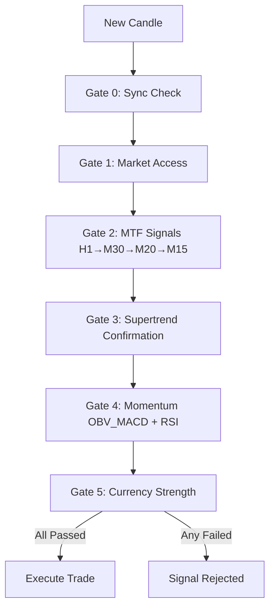

# 🚀 Nexus Confluence EA - Backtest Validation Project

## Project Map & State Tracking

---

## 📊 Estrela do Norte (North Star)

**Objetivo Principal**: Analisar e validar o backtest do NexusConfluenceEA para identificar causas raiz do drawdown catastrófico (93%) e gerar diagnóstico completo com métricas estatísticas.

---

## 🔗 Integrações

| Serviço | Status | Notas |
|---------|--------|-------|
| MT5 Log Parser (UTF-16LE) | ✅ Pronto | iconv -f UTF-16LE -t UTF-8 |
| Python Data Analysis | 🔄 Pendente | pandas, scipy, matplotlib |
| EA Source Code | ✅ Acessível | 10 módulos em Include/NexusConfluenceEA/Modules |

---

## 📁 Fonte da Verdade (Source of Truth)

### Dados do Backtest Analisado

```yaml
EA_Name: NexusConfluenceEA v2.63
Symbol: XAUUSD (Gold)
Timeframe: M15
Period: 2023.01.03 - 2026.01.04
Initial_Deposit: $900 USD
Leverage: 1:200
Execution_Delay: 245ms
Tick_Mode: Real Ticks
```

### Inputs Reais do Backtest (Extraídos do Log)

```yaml
# === RISK MANAGEMENT ===
InpLotSize: 0.07
InpMaxSlippage: 10

# === BUY PARAMETERS ===
InpStopLossBuy: 600      # points
InpTakeProfitBuy: 1500   # points (R:R = 1:2.5)
InpBE_Buy_Enable: true
InpBE_Buy_Trigger: 300
InpBE_Buy_Step: 5
InpTS_Buy_Enable: true
InpTS_Buy_Trigger: 400
InpTS_Buy_Step: 15

# === SELL PARAMETERS ===
InpStopLossSell: 600
InpTakeProfitSell: 1500
InpBE_Sell_Enable: true
InpBE_Sell_Trigger: 300
InpBE_Sell_Step: 5
InpTS_Sell_Enable: true
InpTS_Sell_Trigger: 400
InpTS_Sell_Step: 15

# === SIGNAL FILTERS ===
InpMinScoreBuy: 2
InpMinScoreSell: 4
InpEnableBuy: true
InpEnableSell: true

# === DRAWDOWN PROTECTION ===
InpDD_Enable: false  # ⚠️ DISABLED!
InpDD_DailyMax: 5
InpDD_ConsecLoss: 7
InpDD_LotReduce: 0.5

# === SPREAD FILTER ===
InpEnableSpreadFilter: true
InpMaxSpread: 20
InpSpreadMulti: 1.5
InpSpreadPeriod: 20

# === TIME FILTER ===
InpUseTimeFilter: true
InpStartTime: "00:30"
InpEndTime: "00:29"  # Almost 24h trading

# === MTF TIMEFRAMES ===
InpMacro1TF: PERIOD_H1 (16385)
InpMacro2TF: PERIOD_M30 (30)
InpMacro3TF: PERIOD_M20 (20)
InpOperationalTF: PERIOD_M15 (15)

# === INDICATORS ===
InpGG_Enable: true    # GG TrendBar
InpST_Enable: true    # Supertrend
InpMACD_Enable: true  # OBV_MACD
InpRSI_Enable: true   # RSIOMA
InpCS_Enable: true    # Currency Strength
```

---

## 🎯 Entrega do Payload

### Outputs Esperados

1. **Diagnóstico Estatístico** (Python)
   - Profit Factor, Sharpe Ratio, Max Drawdown
   - Win Rate, Expectancy, t-test de significância
   - Curva de Equity com análise de fases

2. **Relatório de Causa Raiz** (Markdown)
   - 5 Por Quês aplicado às falhas críticas
   - Mapeamento Causa → Consequência

3. **Recomendações de Otimização**
   - Ajustes de parâmetros sugeridos
   - Critérios de entrada/saída revisados

---

## 🧠 Regras Comportamentais

1. **Leitura de Log UTF-16LE**: Sempre usar `iconv -f UTF-16LE -t UTF-8`
2. **Captura Automática de Ativo**: Extrair do log (linha "testing of Experts...")
3. **Inputs Dinâmicos**: Ler inputs reais do log, não os defaults do código
4. **Sem Hardcode**: Código de análise deve ser genérico para qualquer EA/ativo

---

## 📈 Resultado Crítico do Backtest Atual

```
┌─────────────────────────────────────────┐
│  ❌ BACKTEST RESULT: CATASTROPHIC LOSS  │
├─────────────────────────────────────────┤
│  Initial Balance:  $900.00              │
│  Final Balance:    $61.89               │
│  Total Loss:       -$838.11 (-93.1%)    │
│  Total Deals:      ~3000                │
│  Margin Calls:     MULTIPLE (Dec 2025+) │
└─────────────────────────────────────────┘
```

---

## 🏗️ Arquitetura do EA (6-Gate System)



### Módulos do EA

| Módulo | Arquivo | Função |
|--------|---------|--------|
| Core | Core.mqh | State machine, logging |
| Market Access | MarketAccess.mqh | Spread/time filters, session check |
| Indicator Hub | IndicatorHub.mqh | All indicator handles and buffers |
| Signal Engine | SignalEngine.mqh | 6-gate confluence logic |
| Risk Execution | RiskExecution.mqh | Order execution, SL/TP calc |
| Break Even | BreakEvenManager.mqh | Move SL to entry+step |
| Trailing Stop | TrailingStopManager.mqh | Dynamic SL trailing |
| Asymmetric Risk | AsymmetricRisk.mqh | Different BUY/SELL parameters |
| Drawdown Protection | DrawdownProtection.mqh | Daily/consecutive loss limits |
| Inputs Config | NexusInputsConfig.mqh | All input declarations |

### Indicadores

| Indicador | Arquivo | Uso |
|-----------|---------|-----|
| GG TrendBar | GG_TrendBar_Indicator.mq5 | MTF trend direction (Gate 2) |
| Supertrend | TrendMagic_MT5.mq5 | Trend confirmation (Gate 3) |
| OBV_MACD | OBV_MACD.mq5 | Momentum expansion (Gate 4) |
| RSIOMA | RSIOMA_v2HHLSX_MT5.mq5 | RSI alignment (Gate 4) |
| Currency Strength | CurrencyStrengthMeter_MT5.mq5 | Base/Quote strength (Gate 5) |

---

## 📝 Log de Manutenção

| Data | Ação | Responsável |
|------|------|-------------|
| 2026-01-20 | Análise inicial do backtest | System |
| 2026-01-20 | Identificado drawdown 93% | System |
| 2026-01-20 | Criação do projeto de validação | System |

---

*Última atualização: 2026-01-20 13:24 BRT*
